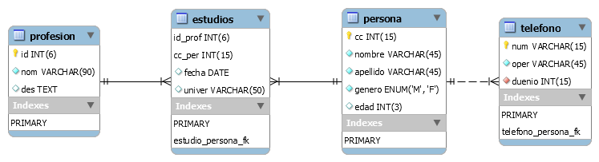

# Persona APP - Hexagonal Architecture
Arquitectura hexagonal con SpringBoot para una aplicación de gestión de personas, profesiones, teléfonos y estudios con dos bases de datos (MariaDB y MongoDB).
## Realizado por
- [David Enrique Palacios García](https://www.github.com/davidpalaciosg)
- Gabriel de Souza

Para ejecutar el proyecto, deben tener instalado:
- Docker y Docker Compose
- Java 11
- IntelliJ IDEA

Para iniciar las bases de datos, deben ejecutar el comando:
```bash
docker-compose up
```
Con las bases de datos listas, se deben ejecutar los scripts de creación de tablas y datos de prueba que se encuentran en la carpeta `scripts`.
La base de datos se rige por el siguiente modelo:



En IntelliJ Idea deben importar el proyecto como un proyecto Maven, agregar Lombok y configurar el SDK de Java 11.

Teniendo todo listo, se pueden iniciar las aplicaciones (SpringBoot Application):
- PersonaAppRestApi: Para iniciar el adaptador de entrada REST en el puerto 3000. Incluye Swagger en http://localhost:3000/swagger-ui.html
- PersonAppCli: Para iniciar el adaptador de entrada CLI. Es una aplicación de consola.

